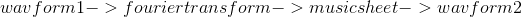

# Music Forecaster

This notebook is made to introduce time series analysis in a fun way! We train an AI to make its own music based on a music file. This was originally presented in a brownbag session with The Collective, a data science group in the Philippines.

This notebook requires
* tensorflow
* scipy
* matplotlib
* numpy
* pandas

The main sections are:
* Load Wav File  - we load a midi music in WAV format. In our example, the input is `canon.wav`
* Split Wav Data into Distinct Elements - we find the "beats" of the music and split by beats
* Find Notes In each Element Using Fourier Transform - using Fourier transformation, we find the frequencies associated with each beat
* Convert into "Music Sheet" - we convert the wav form where the y-axis is amplitude and x-axis is time into a "music sheet" form where the y-axis is the frequency and the x-axis is time. In summary, the transformation is shown below. As a check, wav form 2 must be able to recreate wav form 1. In our example, wav form 1 is `canon.wav` and wav form 2 is `Sine.wav`

</>

* Prepare for Training Model - we transform the "music sheets" into a form for our deep learning model. We define a deep learning model called LSTM which will be trained to predict the next notes based on past notes
* Training Model - here is where we train the model on the transformed dataset
* Predict - here is where we use the trained model to predict the last 20% of the music based on the first 80% of the music
* Convert Notes from Frequencies to Waves - here is where we transform the predictions from "music sheet" into WAV format. In our example, the output is `Sine_2.wav` and the forecast starts at 2:15 marc. Notice that the forecast starts well but worsens as you go further. This is of course something that can be improved with tweaking the neural network and increasing the training time.
